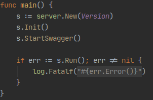
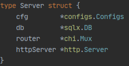

# Structure

This project mostly follows the structure documented at [Standard Go Project Layout](https://github.com/golang-standards/project-layout).

In addition, this project also tries to follow [Clean Architecture](https://blog.cleancoder.com/uncle-bob/2012/08/13/the-clean-architecture.html) where each functionality are separated into different files.

## Starting Point

Starting point of project is at `cmd/go8/main.go`



## Server

A `Server` struct that holds dependencies



`s.Init()` in `internal/server/server.go` simply creates a new server, initializes server configuration, database, router, and domains. Lastly `s.Run()` starts the server.

[](https://github.com/gmhafiz/go8/blob/master/assets/init.png)

## Configurations

[](https://github.com/gmhafiz/go8/blob/master/assets/configs.png)

All environment variables are read into specific `Configs` struct initialized in `configs/configs.go`.Each of the embedded struct are defined in its own file of the same package where its fields are read from either environment variable or `.env` file.

This approach allows code completion when accessing your configurations.


### **.env file**

The `.env` file defines settings for various parts of the API including the database credentials. If you choose to export the variables into environment variables for example:

```text
export DB_DRIVER=postgres
export DB_HOST=localhost
export DB_PORT=5432
etc
```

To add a new type of configuration, for example for Elasticsearch

1. Create a new go file in `./configs`

   ```text
   touch configs/elasticsearch.go
   ```

2. Create a new struct for your type

   ```text
   type Elasticsearch struct {
       Address  string
       User     string
       Password string
   }
   ```

3. Add a constructor for it

   ```text
   func ElasticSearch() *Elasticsearch {
       return &Elasticsearch{
           Address:  os.Getenv("ELASTICSEARCH_ADDRESS"),
           User:     os.Getenv("ELASTICSEARCH_USER"),
           Password: os.Getenv("ELASTICSEARCH_PASS"),
       }
   }
   ```

4. Add to `.env` of the new environment variables

   ```text
   ELASTICSEARCH_ADDRESS=http://localhost:9200
   ELASTICSEARCH_USER=user
   ELASTICSEARCH_PASS=password
   ```

Limiting the number of connection pool avoids ['time-slicing' of the CPU](https://github.com/brettwooldridge/HikariCP/wiki/About-Pool-Sizing). Use the following formula to determine a suitable number

```text
number of connections = ((core_count * 2) + effective_spindle_count)    
```

## Database

Migrations files are stored in `database/migrations` folder. [golang-migrate](https://github.com/golang-migrate/migrate) library is used to perform migration using `task` commands.

## Router

Router or mux is created for use by `Domain`.

Middleware that affects all routes such as CORS, request log and panic recoverer can be registered here.

## Domain

Let us look at how this repository attempts at Clean Architecture. A domain consists of:

1. Handler \(Controllers\)
2. Use case \(Use Cases\)
3. Repository \(Entities\)

Let us look at how `repository` is implemented.


### Repository

Starting with inner most circle, `Entities`. This is where all database operations are handled. Looking at the `internal/domain/health` folder:

[](https://github.com/gmhafiz/go8/blob/master/assets/domain-health.png)

Interfaces for both use case and repository are on its own file under the `health` package while its implementation in its separate `usecase` and `repository` package respectively.

Starting with `internal/domain/health/repository.go`

```text
type Repository interface {
	Readiness() error
}
```

is implemented in a package called `postgres` in `internal/domain/health/repository/postgres/postgres.go`

```text
func (r *repository) Readiness() error {
	return r.db.Ping()
}
```

### Use Case

This is where all business logic lives. By having repository layer underneath in a separate layer, those functions are reusable in other use case layers.

### Handler

This layer is responsible in handling request from outside world and into the `use case` layer. It does the following:

1. Parse request into private 'request' struct
2. Sanitize and validates said struct
3. Pass into `use case` layer
4. Process results from `use case` layer and decide how the payload is going to be formatted to outside world.

Route API are defined in `RegisterHTTPEndPoints` in their respective `register.go` file.

### Dependency Injection

How does dependency injection happens? It starts with `InitDomains()` method.

```text
healthHandler.RegisterHTTPEndPoints(s.router, usecase.NewHealthUseCase(postgres.NewHealthRepository(s.db)))
```

The repository gets access a pointer to `sql.DB` to perform database operations. This layer also knows nothing of layers above it. `NewBookUseCase` depends on that repository and finally the handler depends on the use case.

### Libraries

Initialization of external libraries are located in `third_party/`

